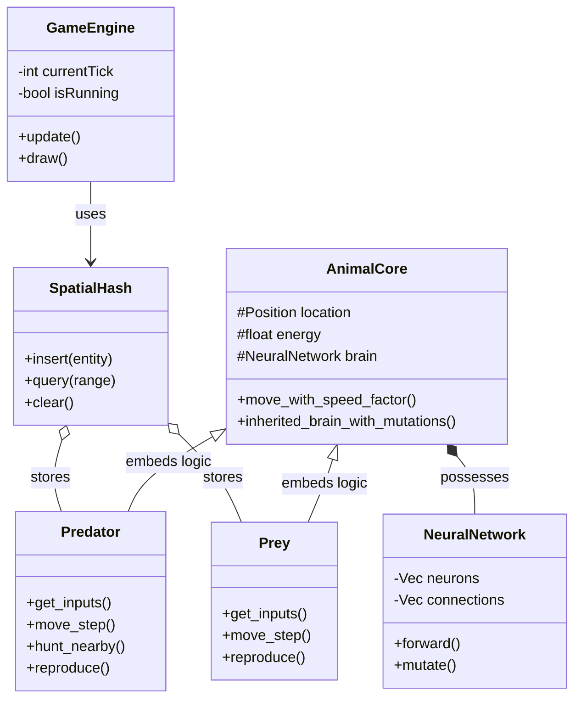

# Evolutionary Predator-Prey Simulation

An advanced simulation of predator-prey dynamics powered by evolving neural networks. Each entity (Predator and Prey) possesses a unique brain that determines its behavior based on sensory inputs, evolving over generations through mutation and natural selection.

## 🌟 Features

- **Neural Network Brains**: Entities are controlled by dynamic neural networks with evolving architectures (Input -> Hidden -> Output).
- **Genetic Evolution**: Survival results in reproduction where offspring inherit and mutate their parent's neural weights and structures.
- **Ray-Cast Vision**: Prey and predators use multi-directional "sights" to detect targets or threats.
- **Optimized Performance**: Uses Spatial Hashing for efficient $O(n)$ proximity queries, allowing for hundreds of simultaneous entities.
- **Interactive Mode**: Take control of a predator yourself to test the survival strategies of the evolving prey.
- **Parameter Search**: Includes a grid-search orchestrator to find the most stable evolutionary parameters.

## 🚀 Getting Started

### Prerequisites

- [Rust](https://www.rust-lang.org/tools/install) (latest stable version)
- `cargo` (comes with Rust)

### Setup

```bash
# Clone the repository
git clone <your-repo-url>
cd foxAndchicks # or predator_vs_prey depending on checkout name

# Build the project in release mode for best performance
cargo build --release
```

## 🎮 Usage & Binaries
 
 ### 1. Main Simulation (Visual)
 Run the standard simulation with Macroquad rendering.
 
 **Command:**
 ```bash
 cargo run --release -- [OPTIONS]
 ```
 
 **Arguments:**
 - `--no-sight` / `--no-sight-lines`: Disable rendering of sight lines (performance boost).
 - `--file <path>` / `-f <path>`: Specify the output recording file path (default: `simulations/data_YYYY-MM-DD...`).
 
 **Example:**
 ```bash
 cargo run --release -- --no-sight -f my_sim.bin
 ```
 
 ### 2. Playback Mode
 Watch a replay of a previously recorded simulation.
 
 **Command:**
 ```bash
 cargo run --release --bin playback -- --file <path> [OPTIONS]
 ```
 
 **Arguments:**
 - `--file <path>` / `-f <path>`: **(Required)** Path to the recording file (e.g., `simulations/predator_vs_prey_123456789.bin`).
 - `--no-sight`: Hide sight lines during playback.
 
 **Controls:**
 - **Space**: Play/Pause
 - **Arrows**: Seek (Left/Right) and Speed Control (Up/Down)
 - **Home/End**: Jump to start or end
 
 ### 3. Headless Recording
 Run the simulation without graphics for faster data collection or long runs.
 
 **Command:**
 ```bash
 cargo run --release --bin record -- [OPTIONS]
 ```
 
 **Arguments:**
 - `--frames <N>` / `-n <N>`: Number of frames to simulate (default: 5000).
 - `--file <path>` / `-f <path>`: Output file path.
 
 ### 4. Interactive Mode
 Control a "Predator" manually with arrow keys to test prey avoidance behaviors.
 
 **Command:**
 ```bash
 cargo run --release --bin interactive_sim_pred_prey
 ```
 
 **Controls:**
 - **Arrow Keys / WASD**: Move and rotate.
 - **Shift**: Move faster.
 
 ### 5. Parameter Search
 Runs multiple parallel headless simulations to find evolutionary parameters that maximize simulation stability.
 
 **Command:**
 ```bash
 cargo run --release --bin param_search
 ```
 
 > **Note:** This runs a hardcoded grid search (currently set to 20 trials). It uses the `headless_runner` binary internally.
 
 ## 🧠 Brain & Evolution

The core of the simulation is the `NeuralNetwork` struct in `src/brain_neural_network.rs`.

### Mutation Parameters
The simulation optimizes for three critical mutation rates:
- **ADD_NEURON**: Chance to add a new hidden neuron.
- **ADD_WEIGHT**: Chance to create a new connection between existing neurons.
- **CHANGE_WEIGHT**: Chance to perturb an existing connection's weight.

## 🛠 Project Structure

### Module Overview

**This cannot be read without mermaid support but will be useful for the presentation**



### Files
 
 - **Core Logic:**
   - `src/main.rs`: Entry point for the main visual simulation.
   - `src/game.rs`: Central game loop and entity management.
   - `src/animals.rs`: Core logic for Predator and Prey entities.
   - `src/brain_neural_network.rs`: Vectorized Neural Network implementation with mutation logic.
   - `src/spatial_hash.rs`: Optimization structure for collision detection.
 
 - **Data & Rendering:**
   - `src/data_manager.rs`: Handles data persistence (saving/loading simulations).
   - `src/visualization.rs`: Rendering logic, UI components, and playback controls.
   - `src/settings.rs`: Global simulation constants and starting values.
 
 - **Binaries (`src/bin/`):**
   - `interactive_sim_pred_prey.rs`: Manual control mode.
   - `record.rs`: Headless recording tool.
   - `playback.rs`: Replay tool for recorded simulations.
   - `param_search.rs`: Parameter optimization tool.
   - `headless_runner.rs`: Internal runner for parameter search.

   ### PARAMETER FINETUNING CAN BE DONE WITH THE FOLLOWING:
   
## - **animals.rs:** 
# Changes to be done in the animals.rs file
    - `REPRO_COOLDOWN_FRAMES`: Prevents immediate re-reproduction (applies per frame)
    - `inherited_brain_with_mutations`: let k = rng.gen_range(2..=6); // Number of mutations
    - Prey.move_step: let threshold = 0.1; threshold, where prey rests, gains energy, if moving, no energy gain

# Changes to be done in the settings.rs file

   **For Animals** // ** = PRED or PREY
   - `MAX_TURN_ANGLE`
   - `*_SIGHT_COUNT`
   - `*_SIGHT_RANGE`
   - `*_SIGHT_ANGLE`
   - `*_ENERGY`
   - `*_SPEED`
   - `*_RADIUS`

   **For Predators**
   - `PRED_DEFAULT_DECAY`
   - `PRED_ENERGY_GAIN`

   **For Prey** 
   - `PREY_REPRODUCATION_RATE`
   - `PREY_REST_ENERGY_GAIN`

## - **neural_network.rs:** 
# Changes to be done in the neural_network.rs file
    - `mutate`: let k = rng.gen_range(2..=6); // Number of mutations
    - let mut w = weight.unwrap_or_else(|| rng.gen_range(-0.2..0.2)); // initial weight 
    - `FULLY_CONNECTED` // set to true for fully connected networks
# Changes to be done in the settings.rs file
    - `MUT_CHANGE_STEP`: Mutation step size
    - `add_neuron()`
    - `add_weight()`
    - `change_weight()`
   - **brain_neural_network.rs:**
   - **settings.rs:**
